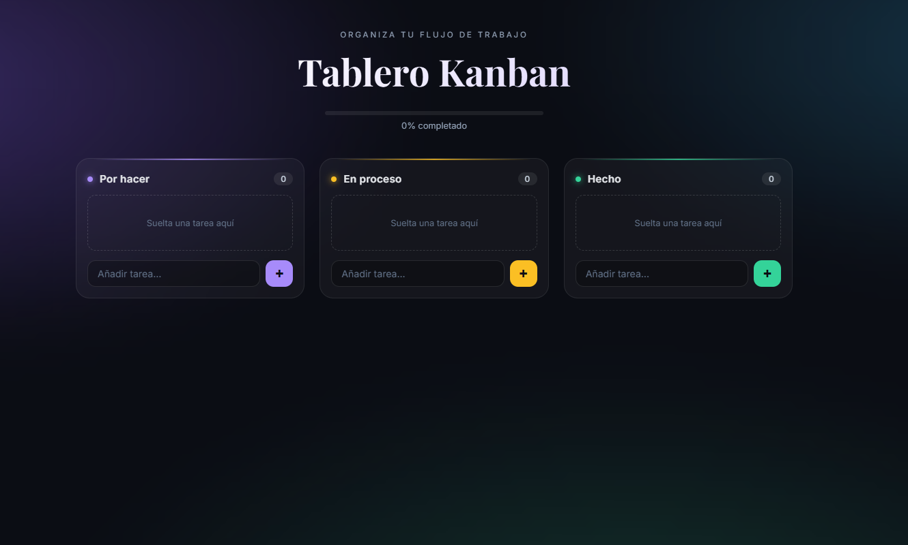
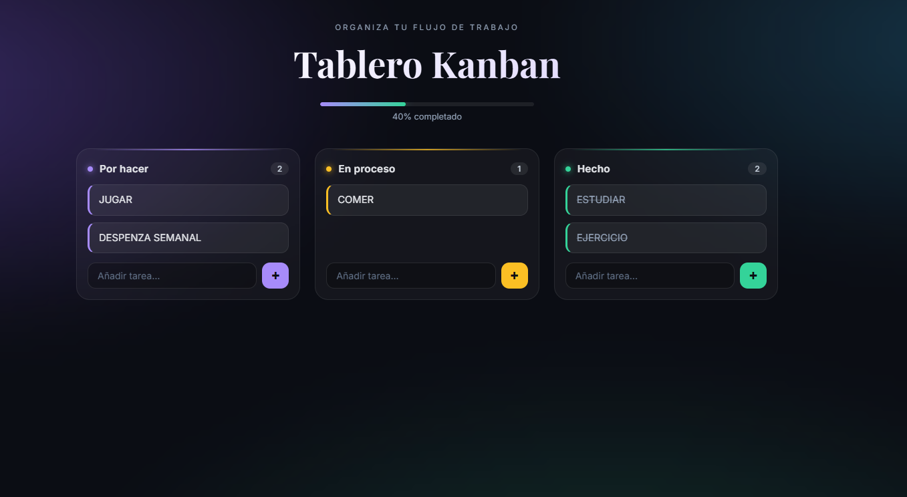

# Tablero Kanban

Tablero de tareas tipo Trello con arrastrar y soltar, barra de progreso y diseño glassmorphism.

## Características
- Tres columnas: Por hacer, En proceso y Hecho
- Arrastrar y soltar tarjetas entre columnas
- Barra de progreso que se actualiza automáticamente
- Los datos se guardan en el navegador (localStorage)
- Diseño responsive y con fondo animado

## Tecnologías
HTML5, CSS3 y JavaScript puro (sin librerías).

## Demo
[Ver proyecto en línea](https://jimenaturcios448.github.io/Tablero_Kanban/)

## Cómo usarlo
1. Descarga o clona el repositorio.
2. Abre `index.html` en tu navegador.

## Capturas

### Pantalla de inicio

### Tablero con tareas
